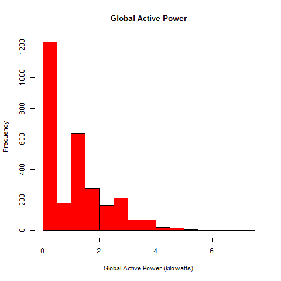
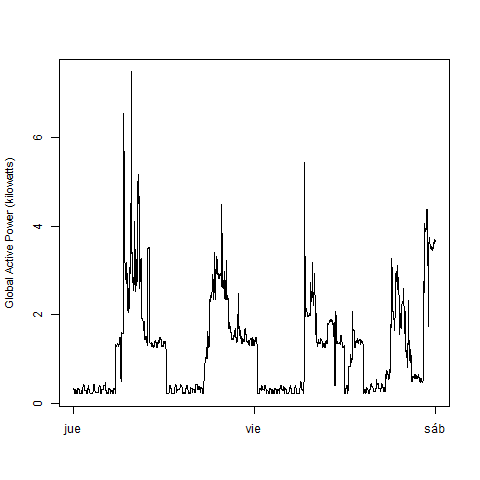
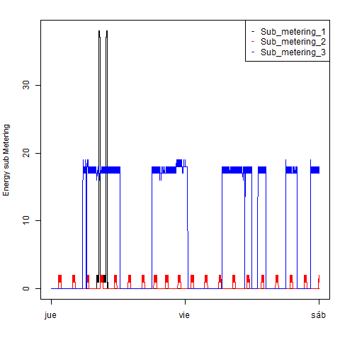
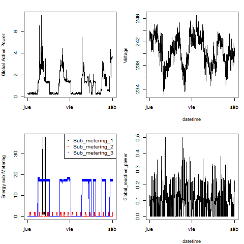

## Introduction

The current assignment code should be loaded along the dataset in .txt format (Same folder).
Establishing the mentioned folder as the working directory `setwd()` should allow the code to run smoothly.

### Important Links
* <b>Dataset</b>: <a href="https://d396qusza40orc.cloudfront.net/exdata%2Fdata%2Fhousehold_power_consumption.zip">Electric power consumption</a> [20Mb]

* <b>Description</b>: Measurements of electric power consumption in
one household with a one-minute sampling rate over a period of almost
4 years. Different electrical quantities and some sub-metering values
are available.

## Making Plots

The four funtions are saved in the same `plotting.R` code, and can be called after <b>sourcing</b> as:

As sourcing also prepares the data, it might take a little while to be ready to call the functions.

*`plot1()`

*`plot2()`

*`plot3()`

*`plot4()`

Each generating a `plot1.png`... `plot4.png` of their own.

The four plots are saved in the current working directory, which should originally contain:
*`plotting.R`
*`household_power_consumption.txt`, not included, you can use your own ORIGINAL copy.

After sourcing the code, and calling each function, you have the following figures

### Plot 1

 

### Plot 2

 

### Plot 3

 

### Plot 4

 

